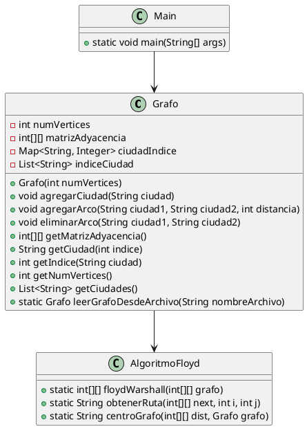

# Proyecto: Algoritmo de Floyd-Warshall y Centro del Grafo

## Descripción

Este proyecto implementa un grafo dirigido y el algoritmo de Floyd-Warshall para encontrar las rutas más cortas entre cualquier par de nodos del grafo. También calcula el centro del grafo. El proyecto incluye implementaciones en Java y Python.

### Estructura del Proyecto

ProyectoGrafo/
├── java/
│ ├── src/
│ │ ├── Grafo.java
│ │ ├── AlgoritmoFloyd.java
│ │ ├── Main.java
│ │ └── tests/
│ │ ├── GrafoTest.java
│ │ └── AlgoritmoFloydTest.java
│ ├── guategrafo.txt
│ ├── uml/
│ │ └── diagrama.uml
│ └── README.md
├── python/
│ ├── main.py
│ ├── grafo.py
│ ├── algoritmo_floyd.py
│ ├── guategrafo.txt
│ ├── uml/
│ │ └── diagrama.uml
│ └── README.md

### Estructura del Archivo guategrafo.txt

El archivo `guategrafo.txt` contiene líneas con tres elementos: `Ciudad1`, `Ciudad2`, `Distancia`, donde `Ciudad1` y `Ciudad2` son los nombres de las ciudades, y `Distancia` es la distancia en kilómetros entre ellas.

Ejemplo de contenido:

```
Mixco Antigua 30
Antigua Escuintla 25
Escuintla SantaLucia 15
```

### Instrucciones para Compilar y Ejecutar el Programa en Java

1. **Clonar el Repositorio:**

   ```bash
   git clone <URL_DEL_REPOSITORIO>
   cd ProyectoGrafo/java
   ```

2. **Compilar el Código:**

   ```bash
   javac -d bin src/*.java src/tests/*.java
   ```

3. **Ejecutar el Programa Principal:**

   ```bash
   java -cp bin Main
   ```

4. **Ejecutar las Pruebas Unitarias:**
   ```bash
   java -cp bin:lib/junit-4.12.jar org.junit.runner.JUnitCore tests.GrafoTest
   java -cp bin:lib/junit-4.12.jar org.junit.runner.JUnitCore tests.AlgoritmoFloydTest
   ```

### Instrucciones para Ejecutar el Programa en Python

1. **Clonar el Repositorio:**

   ```bash
   git clone <URL_DEL_REPOSITORIO>
   cd ProyectoGrafo/python
   ```

2. **Instalar Dependencias:**

   ```bash
   pip install -r requirements.txt
   ```

3. **Ejecutar el Programa Principal:**
   ```bash
   python main.py
   ```

### Resultados Esperados

#### Programa Principal

- **Opción 1:** Ingresar la ciudad origen y destino, mostrar la ruta más corta y las ciudades intermedias.
- **Opción 2:** Mostrar la ciudad que es el centro del grafo.
- **Opción 3:** Modificar el grafo y recalcular las rutas más cortas y el nuevo centro del grafo.
- **Opción 4:** Finalizar el programa.

#### Pruebas Unitarias

- Las pruebas unitarias verifican que se puedan agregar ciudades y arcos al grafo, eliminar arcos, y calcular correctamente las rutas más cortas y el centro del grafo.

### Diagrama UML

El diagrama UML del proyecto está ubicado en el directorio `uml/` tanto para la implementación en Java como en Python.

Contenido del archivo `diagrama.uml`:



### Estructura del Proyecto

- `ProyectoGrafo/java/src/Grafo.java`: Implementación del grafo.
- `ProyectoGrafo/java/src/AlgoritmoFloyd.java`: Implementación del algoritmo de Floyd-Warshall.
- `ProyectoGrafo/java/src/Main.java`: Programa principal.
- `ProyectoGrafo/java/src/tests/GrafoTest.java`: Pruebas unitarias para `Grafo`.
- `ProyectoGrafo/java/src/tests/AlgoritmoFloydTest.java`: Pruebas unitarias para `AlgoritmoFloyd`.
- `ProyectoGrafo/java/guategrafo.txt`: Archivo de entrada con las conexiones entre ciudades.
- `ProyectoGrafo/java/uml/diagrama.uml`: Diagrama UML del proyecto en PlantUML.
- `ProyectoGrafo/python/main.py`: Programa principal en Python.
- `ProyectoGrafo/python/grafo.py`: Implementación del grafo en Python.
- `ProyectoGrafo/python/algoritmo_floyd.py`: Implementación del algoritmo de Floyd-Warshall en Python.
- `ProyectoGrafo/python/guategrafo.txt`: Archivo de entrada con las conexiones entre ciudades.
- `ProyectoGrafo/python/uml/diagrama.uml`: Diagrama UML del proyecto en PlantUML.

## Recomendaciones

- Asegurarse de tener instalado JUnit para ejecutar las pruebas unitarias en Java.
- Para Python, asegurarse de tener NetworkX instalado para la implementación del algoritmo de Floyd-Warshall.
